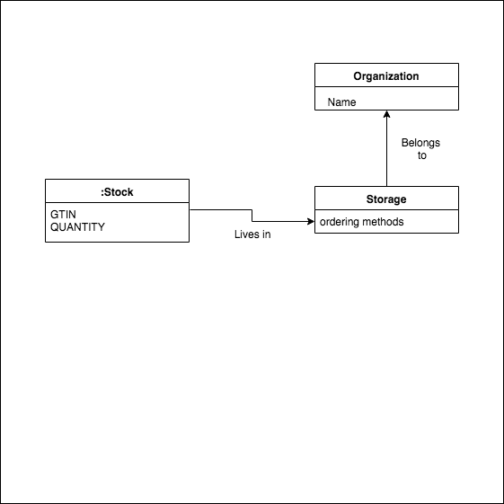

@title[models]

### Models

---

@title[importing]

### 2 ways to import stock (endpoints)

* Public endpoint that allows brands to send their own stock. **No Mistery**
* Private endpoint that receives a S3 file name.

---

@title[private-import]

### Private import

Whenever we get a request on this endpoint we create a job that does the following:

* Download a json file from S3, the name of the file is in the request.
* Parse the file and uses its data to populate the DB with stock information.

---

@title[importing-process]

### Importing Process

* Some brands use the public endpoint.
* Most brands provide us with a way to get their stock, we read it and map it to a unique format that the backend understand and that is written in a file in S3, then we use the private endpoint.

---

@title[getting-stock]

### Getting stock from brands. Methods

There are a few ways to get the stock:
  * Http request, the brand has its own (custom) API.
  * TradeByte, which an API that some brands use.
  * FTP

  ---

  @title[lambda]

  ### Lambda functions (stockLoader repo)

We use a lambda function for each brand, The function is in charge of getting the stock by using one of the methods (http, ftp, etc..), the lambda function also creates the file in S3 and hit the private endpoint. So the steps are;

* Getting the stock.
* Parse it.
* Create a standard file in S3.
* Hit private stock endpoint.

  ---

  @title[ftp]

  ### Ftp

  * Most brands use this method.
  * Some brands upload a file into our FTP.
  * Some brands have their own FTP.
  * We also support SFTP
  * The stock can be provided in the following formats (so far):
    * CSV (most commonly used)
    * JSON
    * XML
